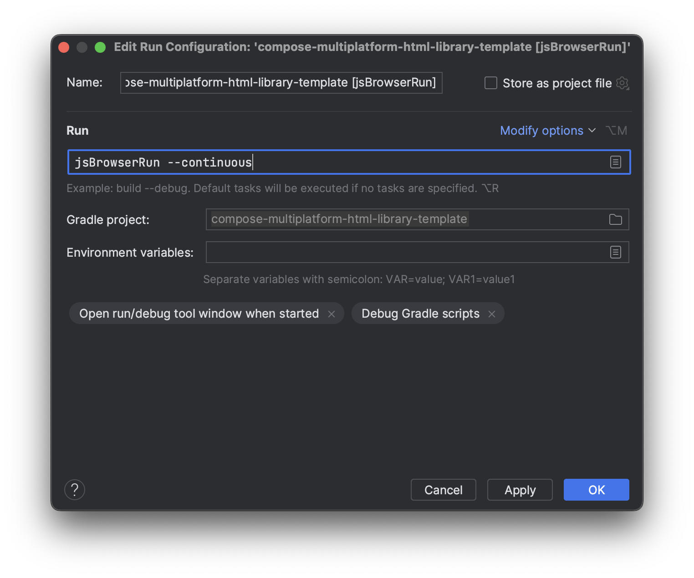

# Compose HTML tutorial

The Compose HTML library is aimed at producing Kotlin/JS output using the same Composable approach as the rest of Kotlin Multiplatform. This tutorial is going to guide you to a simple web app from scratch.

## The end goal

The app that we are going to run is going to be a single page with a click counter: each press of a button is going to add to a counter displayed above the button. We're not going to persistently store anything: the number of clicks will reset to 0 after each reload.


## What you will need

You'll need an IDE and an installed JDK:
* **Intellij IDEA**. While you can use any environment suitable for Gradle projects, this tutorial demonstrates specifically how the project would work in IDEA.
* **JDK 11 or newer**. Whatever your environment, it should have at least JDK 11 installed or integrated.

## Let's make a project

You can clone the template from GitHub, or just create a project from scratch.

* The template is available at the [specific GitHub repository](https://github.com/JetBrains/compose-multiplatform-html-library-template).
  1. Press **Use this template** and create your own repository with the provided code.
  1. Copy the repository address of the template from the **Code** dropdown.
  1. In Intellij IDEA, choose **File → New → Project from Version Control** and paste the address in the **URL** field, then press **Clone**.
* If you would like to create the project from scratch, in IDEA, for example, you can:
  1. Select **File → New → Project**.
  2. Choose Kotlin as the language and Gradle as the build system, then press **Create**. We'll go over the code in the next section.

## Structure of the source code

Important code that enables the app to run is divided between Gradle configuration and source files.


### Gradle configuration

Make sure you reload your Gradle project after changing the configuration files (in IDEA, open the Gradle panel and press the **Reload All Gradle Projects** button).

* Gradle properties the build is going to use:

  ``` title="gradle.properties"
  org.gradle.jvmargs=-Xmx2048m -Dfile.encoding=UTF-8
  kotlin.code.style=official
  kotlin.version=1.9.0
  compose.version=1.4.3
  ```

* Gradle settings for the project. Choose the name to set as `rootProject.name` — this is going to be the name of the compiled .js file in the build output:
  
  ```gradle title="settings.gradle.kts"
  pluginManagement {
      repositories {
          gradlePluginPortal()
          maven("https://maven.pkg.jetbrains.space/public/p/compose/dev")
      }

      plugins {
          kotlin("multiplatform").version(extra["kotlin.version"] as String)
          id("org.jetbrains.compose").version(extra["compose.version"] as String)
      }
  }
  
  rootProject.name = "change-to-your-project-name"
  ```

* Gradle build script (make sure `kotlin.srcDir` and `resources.srcDir` point to existing folders):

  ```gradle title="build.gradle.kts"
  plugins {
    kotlin("multiplatform")
    id("org.jetbrains.compose")
  }

  repositories {
      mavenCentral()
      maven("https://maven.pkg.jetbrains.space/public/p/compose/dev")
      google()
  }

  kotlin {
      js(IR) {
          browser()
          binaries.executable()
      }
      sourceSets {
          val jsMain by getting {
              kotlin.srcDir("src/main/kotlin")
              resources.srcDir("src/main/resources")

              dependencies {
                  implementation(compose.html.core)
                  implementation(compose.runtime)
              }
          }
      }
  }
  ```

### Source code

The source code for the app consists of two files:
* an HTML file that is going to be used to embed the JS code (should be put in the `resources.srcDir` folder specified in `build.gradle.kts`),
* a Kotlin file describing the logic and the Composable that we are using (should be put in the `kotlin.srcDir` folder).

The [HTML file](https://github.com/JetBrains/compose-multiplatform-html-library-template/blob/main/src/main/resources/index.html) is describing a very barebones structure, the important parts are these:

```html

<!-- Kotlin code is going to refer to this element to render the Composable. -->
<div id="root"></div>

<!-- The name of the .js file must match the value of rootProject.name in the settings.gradle.kts file. -->
<script src="compose-multiplatform-html-library-template.js"></script>
```

The [Kotlin file](https://github.com/JetBrains/compose-multiplatform-html-library-template/blob/main/src/main/kotlin/main.kt) describes the `Body()` Composable and renders it in the `main()` function:

```kotlin
fun main() {
    // rootElementId is the id of the HTML element where the Composable should be rendered.
    renderComposable(rootElementId = "root") {
        Body()
    }
}

@Composable
fun Body() {
    var counter by remember { mutableStateOf(0) }

    // <div> displaying the number of clicks.
    Div {
        Text("Clicked: ${counter}")
    }

    // Button that increases the counter.
    Button(
        attrs = {
            onClick { _ ->
                counter++
            }
        }
    ) {
        Text("Click")
    }
}
```

## Run the project

When everything is in place, make sure you rebuilt the Gradle project to account for changes in configuration, and run it:

   * To build the current version, start the Gradle task **kotlin browser → jsBrowserRun** in IDEA, or run this shell command:  `./gradlew jsBrowserRun`
   * To make the build watch changes in the files and rebuild the project on the fly, use the command `./gradlew jsBrowserRun --continuous`. You can also modify the **jsBrowserRun** Gradle task in IDEA to make it start like this by default:
      

## What's next

Now you have built and run a simple, but complete Kotlin/JS app. If it looks useful, you can explore the Compose HTML further:

* [Style the components of your app](https://github.com/JetBrains/compose-multiplatform/tree/master/tutorials/HTML/Style_Dsl)
* [Build a more complex UI](https://github.com/JetBrains/compose-multiplatform/tree/master/tutorials/HTML/Building_UI)
* [Handle events](https://github.com/JetBrains/compose-multiplatform/tree/master/tutorials/HTML/Events_Handling)